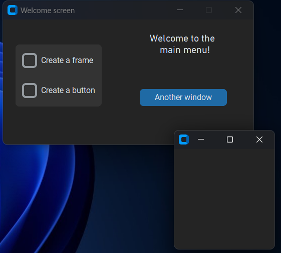

# PassPol-Password-Manager
Twórcy: **Krzysztof Wdowczyk** i **Kamil Golec**

Link do prezentacji: https://docs.google.com/presentation/d/1Z_tATawzf0WcXJloLDX2Cqe2d2JDVse7VLC0JwkTEJU/edit?usp=sharing

# Zadania

**Zadanie 1**
> Wykorzystując wygenerowany klucz z biblioteki Fernet, zaszyfruj wiadomość "Poufne dane", szyfrogram wypisz na ekranie.
> Następnie zdeszyfruj wiadomość i sprawdź, czy otrzymaliśmy spowrotem prawidłowy tekst jawny, wypisując go na ekranie.
---
**Zadanie 2**
> Zdeszyfruj plik top_secret.txt, wykorzystując hasło "Jp_wP1" i sól "saltsalt". Wykorzystaj w tym celu generowanie klucza
> za pomocą biblioteki argon2. Zdeszyfrowaną wiadomość wypisz na ekranie.
---
**Zadanie 3**
> Za pomocą biblioteki customtkinter stwórz prostą ramkę, która będzie nazwana "My first frame", a na środku będzie
> miała napis "My first label".
---
**Zadanie 4**
> 

    
    
This is my picture.

 
Stworz interfejs przedstawiony na obrazku. Po wciśnięciu przycisku powinno pojawiać się nowe okno.

